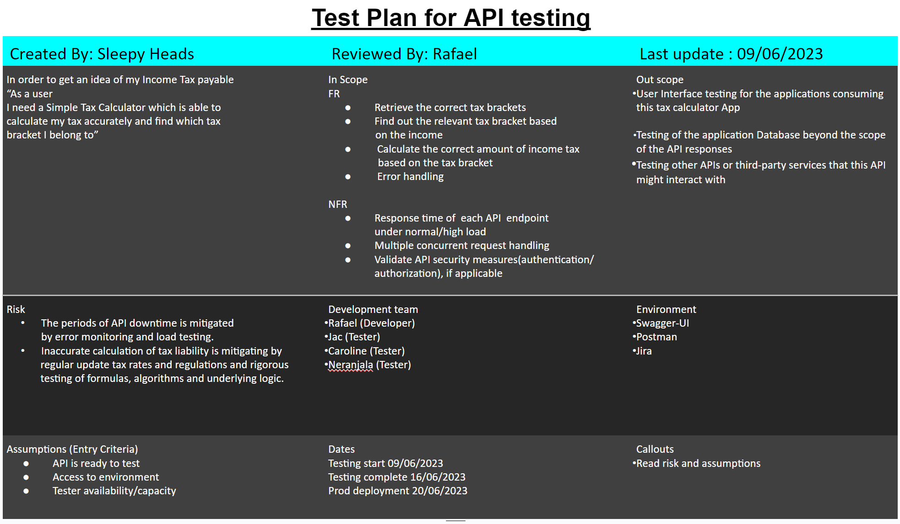

# INDEX
- [PROJECT DESCRIPTION](#project-description)
- [TEST APPROACH](#test-approach)
  - [Test Levels](#test-levels)
    - [Unit Testing](#unit-testing)
    - [Integration Testing](#integration-testing)
# PROJECT DESCRIPTION

# Test Approach

## Test Levels
### Unit Testing

### Integration Testing
### System Testing
### Acceptance Testing

## Test Types
### Black Box
#### Functional Testing
#### Non-Functional Testing

### White Box

# Test Management
## Jira
### Zephyr Scale

[UI Component Test Suite](https://techdojob2.atlassian.net/projects/ST?selectedItem=com.atlassian.plugins.atlassian-connect-plugin:com.kanoah.test-manager__main-project-page#!/v2/testCases?projectId=10002)

## Test Plans
### Sprint 1

#### Test Artifacts
[UI Component Test Suite](https://techdojob2.atlassian.net/projects/ST?selectedItem=com.atlassian.plugins.atlassian-connect-plugin:com.kanoah.test-manager__main-project-page#!/v2/testCases?projectId=10002)

[**Income Tax Calculator** UI Analysis and Design](https://onedrive.live.com/edit.aspx?resid=2D6E5952BC1F4D27!19121&ithint=file%2cdocx&ct=1690190796276&wdOrigin=OFFICECOM-WEB.START.EDGEWORTH&wdPreviousSessionSrc=HarmonyWeb&wdPreviousSession=63196499-6aed-431c-b1a9-69c6f71a262a)

# Agile/Scrum Metrics

# Defect Management

# Test Exit Report

